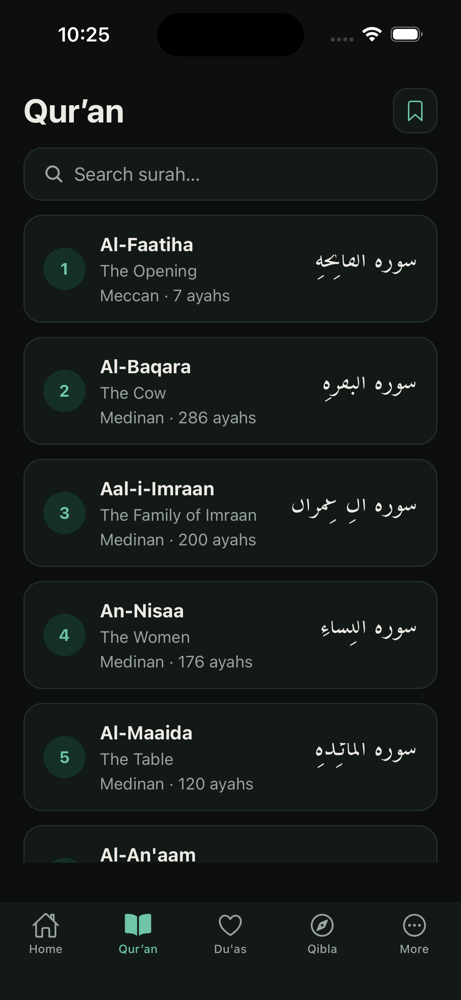
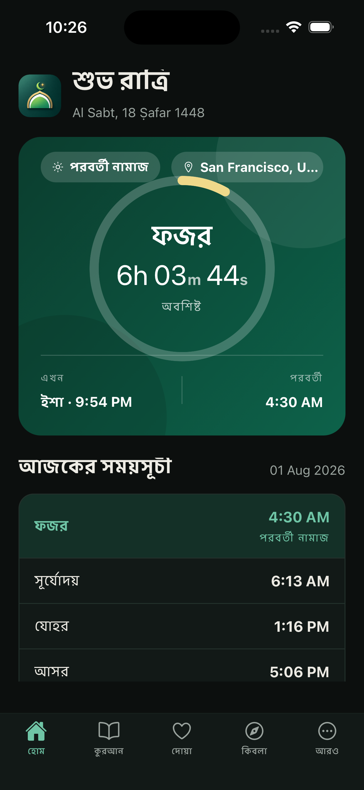
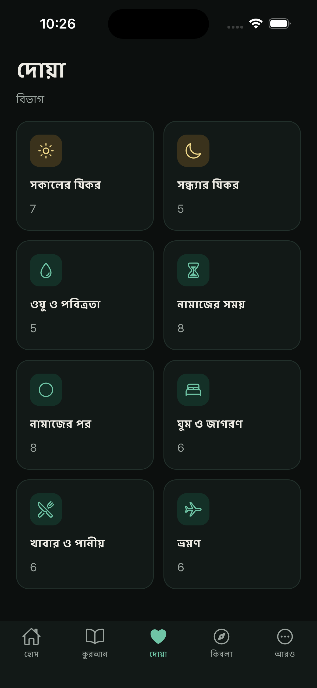
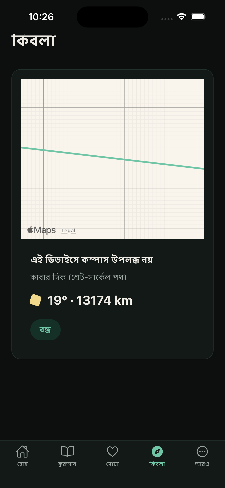
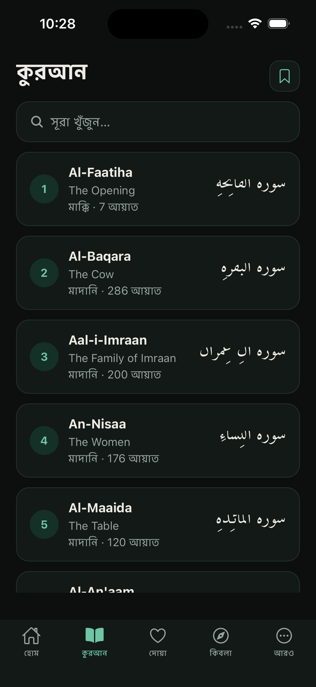
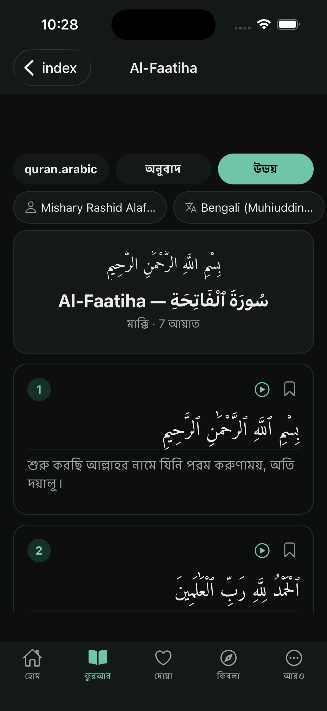
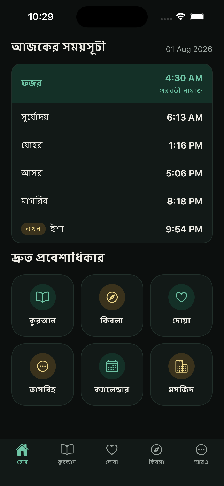
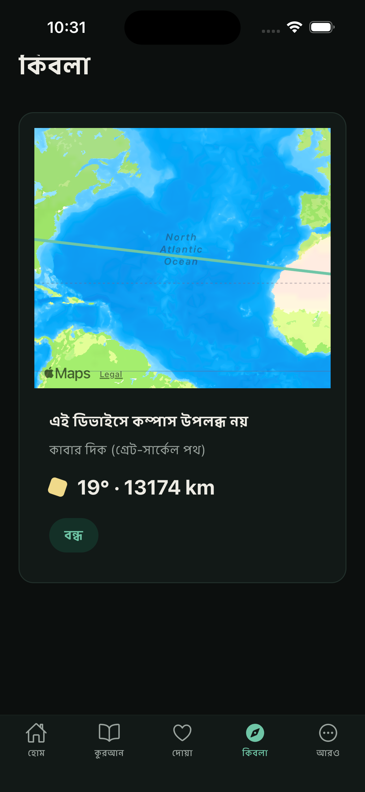

# Noorly 🌙

**Noorly** is a full-featured Islamic lifestyle companion built with **Expo / React Native**. It brings your daily worship essentials together in one beautiful, offline-friendly app — prayer times, the Holy Quran with translations and tafsir, duas, Qibla direction, digital tasbeeh, an Islamic/Hijri calendar, and a mosque finder.

---

## ✨ Features

- 🕌 **Prayer Times** — accurate daily timings powered by 4 calculation methods, with a live countdown ring, 24h/12h clock, and prayer reminders.
- 📗 **Quran Reader** — Arabic text (Uthmani script) with 10+ translation editions, 6 tafsir editions, per-ayah audio recitation from 6 world-renowned qaris, bookmarks, and continue-reading.
- 🤲 **Duas** — a curated collection of daily supplications organized by category with favorites.
- 🧭 **Qibla** — real-time compass showing the direction of the Kaaba with distance.
- 📿 **Tasbeeh** — digital counter for dhikr with haptic feedback.
- 📅 **Hijri Calendar** — Islamic dates and occasions.
- 🕌 **Mosque Finder** — discover nearby mosques on an interactive map with directions.
- 🌍 **Multilingual RTL-ready** — English, Arabic, and Bengali with full RTL layout support.
- 🌗 **Theming** — light / dark / system appearance with a cohesive emerald palette.
- 💎 **Premium** — in-app premium tier (Plausible privacy-respecting setup).

---

## 📸 Demo

| | | | |
|:---:|:---:|:---:|:---:|
|  |  |  |  |

| | | | |
|:---:|:---:|:---:|:---:|
|  |  |  |  |

> Screenshots live in [`assets/screenshot/`](assets/screenshot/).

---

## 🔌 API Providers

Noorly stays **free** and **keyless** by relying on open, public APIs:

| Service | Base URL | Used For |
|:--------|:---------|:---------|
| [AlAdhan](https://aladhan.com/prayer-times-api) | `https://api.aladhan.com/v1` | Prayer times, Gregorian/Hijri calendar |
| [AlQuran Cloud](https://alquran.cloud) | `https://api.alquran.cloud/v1` | Quran text, translations, tafsir editions |
| [UmmahAPI](https://www.ummahapi.com) | `https://www.ummahapi.com/api/duas` | Dua collections |
| [OpenStreetMap Nominatim](https://nominatim.org/) | `https://nominatim.openstreetmap.org/search` | Location geocoding / reverse geocoding |
| [Overpass API](https://overpass-api.de/) | `https://overpass-api.de/api/interpreter` | Nearby mosque (POI) queries |
| [Islamic Network CDN](https://cdn.islamic.network) | `https://cdn.islamic.network/quran/audio` | Quran audio (MP3 per ayah) |
| [EveryAyah](https://everyayah.com) | `https://everyayah.com/data` | Per-ayah audio (multiple reciters) |

All requests include timeout/abort handling and graceful offline fallbacks (embedded surah list, cached data).

---

## 🚀 Getting Started

**Prerequisites:** Node.js 18+, npm, and the [Expo](https://docs.expo.dev) CLI. iOS/Android SDKs only needed for native devices.

```bash
# 1. Install dependencies
npm install

# 2. Start the dev server
npx expo start
```

From the terminal output you can open the app on:

- **iOS Simulator** — press `i`
- **Android Emulator** — press `a`
- **Web** — press `w`
- **Expo Go** — scan the QR code with your device

> This project uses file-based routing via **Expo Router**. Edit screens under the `app/` directory.

---

## 🛠 Tech Stack

- **Expo SDK 54** · Expo Router · React Native 0.81 · React 19
- **Zustand** (state & persistence) · **react-i18next** (i18n, RTL)
- **react-native-reanimated** · **expo-sensors** · **react-native-maps** · **expo-audio**
- **expo-location** · **expo-notifications** · **expo-haptics** · **expo-linear-gradient**

---
